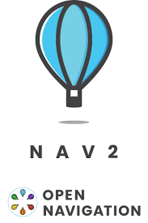

# Nav2_MindCloud_R&D
a repository contain usefull data,links,pages,examples,videos explain deeply Nav2 Stack and its architecture 

## First Important Links & Papers
1. Documintation link : https://docs.nav2.org/
2. repository of Nav2 : https://github.com/ros-navigation/navigation2
3. Automatic Addison :

## Second Steps for using Nav2 
#### First : 

* Source your ROS 2 installation to set up the environment:

`source /opt/ros/Jazzy/setup.bash`

* Download Nav2 \
`sudo apt install ros-$ROS_DISTRO-navigation2`  
`sudo apt install ros-$ROS_DISTRO-nav2-bringup`

> note : To know your ROS_DISTRO

> use : `echo $ROS_DISTRO` it will prints the your ros2 version 

*  Check that Nav2 has downloaded succsesfully  
`source /opt/ros/jazzy/setup.bash`\
`export TURTLEBOT3_MODEL=waffle`\
`export GZ_SIM_RESOURCE_PATH=$GZ_SIM_RESOURCE_PATH:/opt/ros/jazzy/share/turtlebot3_gazebo/models`

`ros2 launch turtlebot3_gazebo turtlebot3_world.launch.py`

After this you must see that all thing is working.

## Third Important Concepts 

